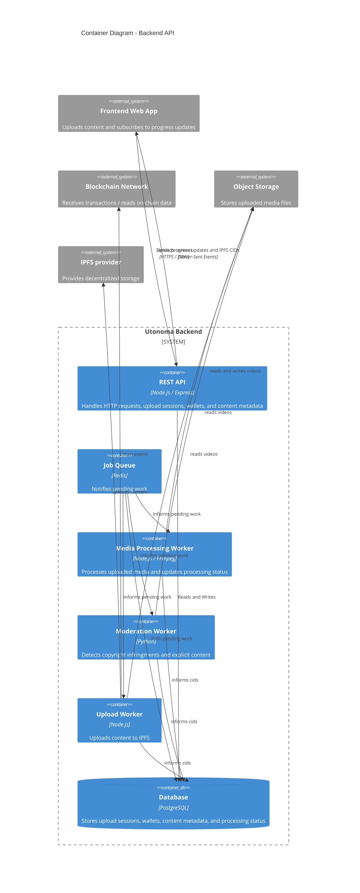
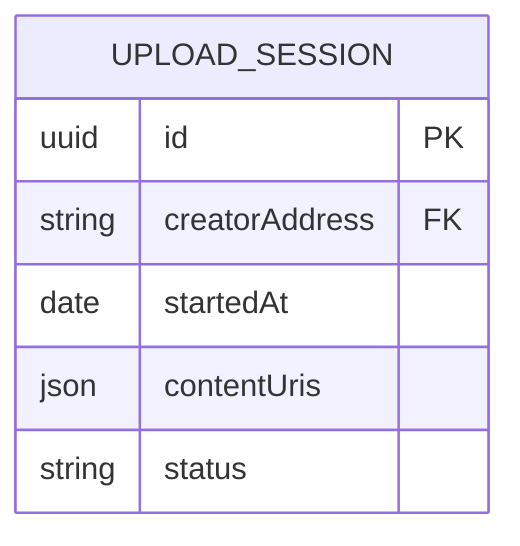

Readme.md

Steps to run the backend:

1. Install the Postresql and start the server
sudo apt update
sudo apt install -y postgresql postgresql-contrib
sudo systemctl start postgresql

2. Create user 
CREATE USER myuser WITH PASSWORD 'mypassword';
CREATE DATABASE mydb OWNER myuser;
Exit with the next command: \q

3. Create the table in the db, schema.sql can be find in the root folder of the 
project
psql -h localhost -U myuser -d mydb -f schema.sql

4. Update your .env to reflect your user and password in postresql

5. Install the project with npm install

6. Install ffmpeg with sudo apt install ffmpeg or similar (depending on os). This is important as we call ffmpeg from node

6. run with npm run dev 
do not forget to run "sudo systemctl start postgresql" to start the postresql server

### Backend Container Diagram

### Entity - Relation diagram

